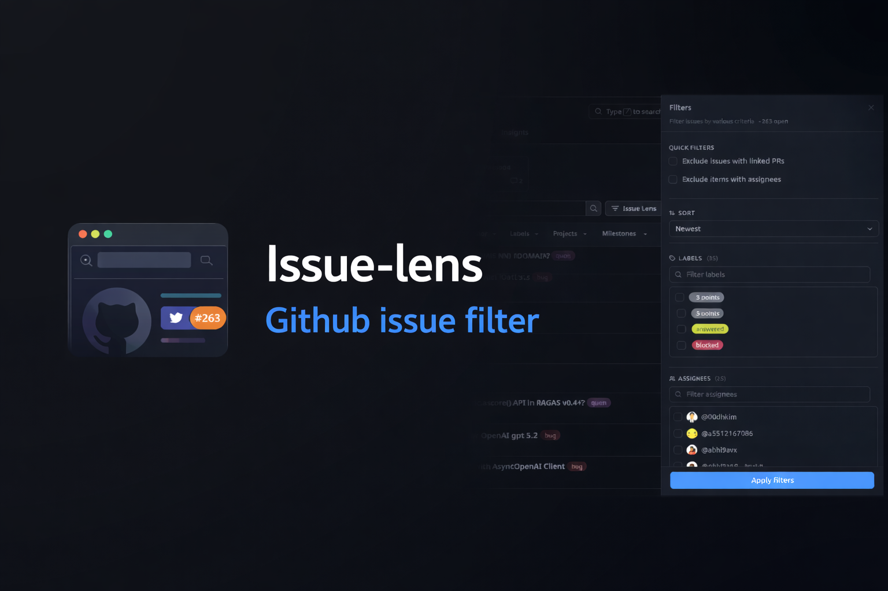

# Issue Lens

[](https://github.com/cgaswin/issue-lens)
[](LICENSE)

A modern browser extension that adds advanced filtering and search capabilities to GitHub Issues. Built with React, TypeScript, and Tailwind CSS.



## Features

- **Multi-Label Filtering** - Filter issues by multiple labels simultaneously
- **Assignee Selection** - Quickly filter by assignee or find unassigned issues
- **Smart Sorting** - Sort by newest, oldest, most commented, or recently updated
- **Hide Pull Requests** - Option to hide PRs from the issues list
- **Modern UI** - Clean, responsive interface with smooth animations
- **GitHub Native** - Seamlessly integrates with GitHub's existing interface

## Installation

### Firefox

1. Download the latest release from [Firefox Add-ons](https://addons.mozilla.org)
2. Or build from source:
   ```bash
   bun install
   bun run build:firefox
   ```
   Then load the `.output/firefox-<version>.zip` file in `about:debugging`

### Chrome (coming soon)

Chrome Web Store submission is planned for a future release.

## Development

### Prerequisites

- Node.js 18+
- [Bun](https://bun.sh) (recommended) or npm/yarn

### Setup

```bash
# Install dependencies
bun install

# Start development server (Chrome)
bun run dev

# Start development server (Firefox)
bun run dev:firefox

# Build for production
bun run build

# Build for Firefox
bun run build:firefox

# Create distribution zip
bun run zip:firefox
```

### Project Structure

```
issue-lens/
├── entrypoints/          # Extension entry points
│   ├── content/         # Content script (GitHub page injection)
│   ├── popup/           # Browser popup
│   └── background.ts    # Background script
├── src/
│   ├── components/ui/   # UI components
│   └── lib/            # Utilities
├── public/icon/        # Extension icons
└── wxt.config.ts       # WXT configuration
```

## Usage

1. Navigate to any GitHub repository's Issues page
2. Click the filter icon in the top-right corner
3. Use the intuitive filter panel to:
   - Select multiple labels
   - Choose assignees
   - Toggle "Hide Pull Requests"
   - Sort issues by various criteria
4. Watch the issues list update in real-time

## Privacy

Issue Lens respects your privacy:
- No data collection
- No analytics
- No external API calls except to GitHub
- All processing happens locally in your browser

See our [Privacy Policy](PRIVACY.md) for details.

## Browser Permissions

- **Storage** - Save your filter preferences locally
- **Host Permission** - Access GitHub issues pages only

## Contributing

Contributions are welcome! Please feel free to submit a Pull Request.

1. Fork the repository
2. Create your feature branch (`git checkout -b feature/AmazingFeature`)
3. Commit your changes (`git commit -m 'Add some AmazingFeature'`)
4. Push to the branch (`git push origin feature/AmazingFeature`)
5. Open a Pull Request

## License

This project is licensed under the MIT License.

## Acknowledgments

- Built with [WXT](https://wxt.dev) - Next-gen web extension framework
- UI components from [shadcn/ui](https://ui.shadcn.com) and [Radix UI](https://radix-ui.com)
- Styled with [Tailwind CSS](https://tailwindcss.com)

## Support

If you encounter any issues or have suggestions, please [open an issue](https://github.com/yourusername/issue-lens/issues).

---

Made with ❤️ by Aswin
